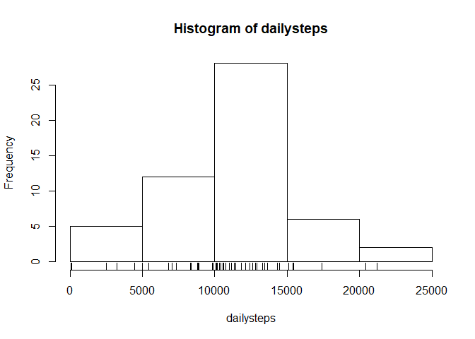
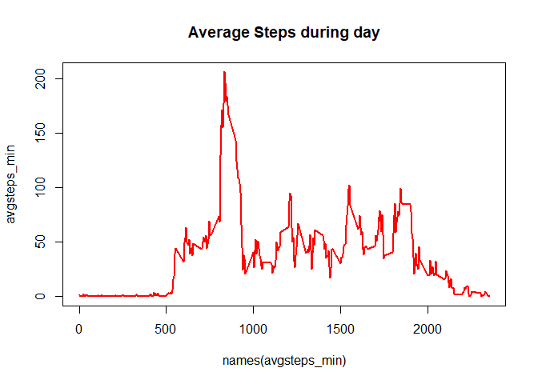

## Loading and preprocessing the data

```r
unzip("activity.zip")
activity <- read.csv("activity.csv")
```

### Histogram of the total number of steps taken each day
This histogram is for exploring the data

```r
dailysteps <- tapply(activity$steps, activity$date, sum)
hist(dailysteps)
rug(dailysteps)
```

<!-- -->

## What is mean total number of steps taken per day?

```r
mean(activity$steps, na.rm = TRUE)
```

```
## [1] 37.3826
```

### The median number of steps taken per day is also shown

```r
median(activity$steps, na.rm = TRUE)
```

```
## [1] 0
```
Since we have a lot of days with 0 values, the median is 0.

## What is the average daily activity pattern?

```r
avgsteps_min <- tapply(activity$steps, activity$interval, mean, na.rm = TRUE)
plot(x = names(avgsteps_min), y = avgsteps_min, type = "l", lwd = 2, cex = 2, col= "red")
title(main = "Average Steps during day")
```

<!-- -->

### 5-minute interval, on average across all the days in the dataset, that contains the maximum number of steps

```r
avgsteps_min[avgsteps_min == max(avgsteps_min)]
```

```
##      835 
## 206.1698
```

We get the max steps at 8:35

## Imputing missing values

total number of missing values in the dataset 

```r
sum(is.na(activity$steps))
```

```
## [1] 2304
```

```r
library("tidyr")
```


## Are there differences in activity patterns between weekdays and weekends?
